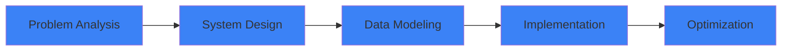

<div align="center">

# Justin Ocaña

### Backend Developer focused on System Architecture


Based in Ecuador

</div>

---

## About

```python
class BackendArchitect:
    def __init__(self):
        self.location = "Ecuador"
        self.role = "Backend Developer"
        self.specialization = "System Architecture"
        self.stack = ["Python", "Django", "PostgreSQL"]
        self.focus_areas = [
            "Multi-tenant SaaS",
            "Database Design",
            "Permission Systems"
        ]
    
    def philosophy(self):
        return "Design first. Code second."
    
    def approach(self):
        return [
            "Understand the problem",
            "Model the system",
            "Build with purpose"
        ]
```

<div align="center">



</div>

I design and build structured backend systems with emphasis on long-term maintainability, database integrity, and scalable SaaS foundations. My approach prioritizes architectural decisions before implementation, ensuring systems are built on solid foundations.

---

## Architecture Focus

<table>
<tr>
<td width="50%">

### Design Principles
```
┌─────────────────────────────┐
│  Data Modeling First        │
│  ↓                          │
│  Permission Architecture    │
│  ↓                          │
│  Business Logic Layer       │
│  ↓                          │
│  Infrastructure             │
└─────────────────────────────┘
```

</td>
<td width="50%">

### Core Expertise

**Multi-tenant Architecture**  
Schema-level isolation for SaaS platforms

**Database Design**  
Normalized relational structures

**Permission Systems**  
Authorization as core design layer

**Domain Logic**  
Clear separation from infrastructure

</td>
</tr>
</table>

---

## Technical Stack

<div align="center">

| Backend | Database | Infrastructure |
|:-------:|:--------:|:--------------:|
|  |  |  |
|  |  |  |

</div>

<div align="center">

```ascii
┌──────────────────────────────────────────────────────────┐
│                    Architecture Stack                     │
├──────────────────────────────────────────────────────────┤
│  Django REST Framework  →  Business Logic Layer          │
│  PostgreSQL/MongoDB     →  Data Persistence              │
│  Docker                 →  Containerization              │
│  Git                    →  Version Control               │
└──────────────────────────────────────────────────────────┘
```

</div>

---

## Selected Work

<details open>
<summary><b>🏢 Agenda Virtual EIWA</b> — Production System</summary>
<br>

Digital agenda platform with real-time collaboration for educational institutions.

**Architecture Decisions:**
- Designed modular backend architecture with clear domain separation (8 apps)
- Implemented hierarchical role-based permission system
- Optimized PostgreSQL schema for relational data integrity

**Tech:** Django • PostgreSQL • REST API

</details>

<details>
<summary><b>💰 SouthernPOS</b> — Multi-Tenant SaaS</summary>
<br>

Cloud-based point-of-sale system for restaurants and retail businesses.

**Architecture Decisions:**
- Architected multi-tenant schema isolation strategy
- Designed real-time inventory management system
- Integrated payment gateway with transaction handling

**Tech:** Django • PostgreSQL • Multi-Tenant Architecture

</details>

<details>
<summary><b>🎮 Plugsite</b> — E-commerce Platform</summary>
<br>

Multi-tenant SaaS platform for Minecraft server stores with automated payment processing.

**Architecture Decisions:**
- Designed tenant-isolated MongoDB architecture
- Implemented PayPal IPN webhook processing system
- Built automated withdrawal and payout system

**Tech:** Django • MongoDB • PayPal Integration

</details>

---

## Core Principles

<div align="center">

```
╔════════════════════════════════════════════════════════╗
║                                                        ║
║  ✓  Design before implementation                      ║
║  ✓  Structure logic clearly                           ║
║  ✓  Keep systems maintainable                         ║
║  ✓  Use AI strategically, not blindly                 ║
║  ✓  Build solutions that scale                        ║
║                                                        ║
╚════════════════════════════════════════════════════════╝
```

</div>

---

## GitHub Stats

<div align="center">


</div>

---

## Current Focus

<table>
<tr>
<td width="33%" align="center">

**Multi-Tenant Architecture**

Refining isolation strategies and schema design patterns

</td>
<td width="33%" align="center">

**Database Modeling**

Improving relational design and query optimization

</td>
<td width="33%" align="center">

**Scalable Systems**

Strengthening backend architecture foundations

</td>
</tr>
</table>

<div align="center">

```
Active Projects: SouthernPOS • Plugsite
```

</div>

---

## Contact

<div align="center">

[](mailto:justin.ocana.molina@gmail.com)
[](https://justin-ocana.github.io/)
[](https://github.com/Justin-Ocana)

</div>

---

<div align="center">

```
┌─────────────────────────────────────────────────────────┐
│                                                         │
│  "Solving real problems.                                │
│   I design systems before I write code."                │
│                                                         │
└─────────────────────────────────────────────────────────┘
```


</div>
